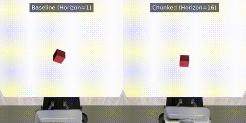

# Action Horizon Ablation for Robot Manipulation

A controlled ablation study measuring how action prediction horizon (chunking) affects task success rate in imitation-learned manipulation policies.



## Summary

Trained behavior-cloned policies on a simulated pick-and-lift task (RoboSuite `Lift`, Panda arm), varying only the **action prediction horizon** while holding observation space, action representation, dataset, and architecture fixed. Found that success rate nearly tripled going from single-step prediction to a horizon of 16, but degraded at horizon 32 — revealing a non-monotonic tradeoff between temporal smoothing and compounding open-loop error.

## Results

| Condition | Horizon | Success Rate |
|---|---|---|
| Baseline | 1 | 22% |
| Chunk-8 | 8 | 32% |
| Chunk-16 | 16 | **62%** |
| Chunk-32 | 32 | 56% |

*(50 evaluation episodes per condition)*

Full writeup: [`writeup.pdf`](./writeup.pdf)

## Setup

- **Task:** RoboSuite `Lift` — Panda arm grasps and lifts a cube above a height threshold
- **Data:** 150 expert demonstrations (RoboSuite/robomimic `Lift` dataset, replayed through sim to regenerate observations)
- **Observation space:** 14-dim state vector — end-effector position (3), end-effector orientation/quaternion (4), joint positions (7). No visual input.
- **Architecture:** 3-layer MLP (hidden dim 256, ReLU, tanh-bounded output)
- **Training:** Behavior cloning, MSE loss between predicted and expert actions
- **Action representation:** Native joint-space actions (7-dim), held constant
- **Variable:** Action horizon $H \in \{1, 8, 16, 32\}$ — number of future actions predicted per forward pass, executed open-loop before re-observing

## Repo structure

```
.
├── baseline/                # Horizon=1 training, eval scripts
├── chunk/                   # Horizon=8/16/32 training, eval scripts
├── dataset.py                # Shared dataset / dataloader class
├── data_collection.py        # Replays raw demos through sim to generate observations
├── download_dataset.py       # Downloads official RoboSuite/robomimic Lift demos
├── writeup.pdf               # Full research writeup
├── comparison.mp4            # Side-by-side demo: baseline vs. best chunked policy
├── .gitignore
└── README.md
```

> **Note:** raw demonstration files (`official_demos/`, `demos_with_obs/`) and trained checkpoints (`**/checkpoints/`) are excluded via `.gitignore` to keep the repo lightweight. Use the reproduction steps below to regenerate them.

## Reproducing

```bash
# 1. Download official expert demonstrations
python download_dataset.py

# 2. Replay demos through the simulator to generate full observations (state + images)
python data_collection.py

# 3. Train a policy (choose horizon inside the script, default = baseline horizon 1)
python baseline/train.py
# or for chunked horizons:
python chunk/train.py

# 4. Evaluate over 50 episodes
python baseline/eval.py
python chunk/eval.py
```

## Key finding

Action chunking improves policy performance substantially over single-step prediction, but the benefit is bounded. Longer horizons commit the policy to more open-loop steps before re-observing the environment, so early prediction errors have more room to compound. Horizon should be tuned as an explicit hyperparameter, not assumed to scale favorably without limit.

## Limitations

- Single task, single seed per condition
- Simple MLP rather than more expressive sequence models (e.g. diffusion-based action heads)
- Modest dataset size (150 demos); optimal horizon may shift with more data
- Demonstrations replayed through sim rather than collected via live teleoperation

## Tools

`RoboSuite` · `MuJoCo` · `PyTorch` · `h5py`

## Author

Janani Venkatramani — built as part of robot learning research practice, demonstrating data efficiency and ablation methodology relevant to vision-language-action model research.
